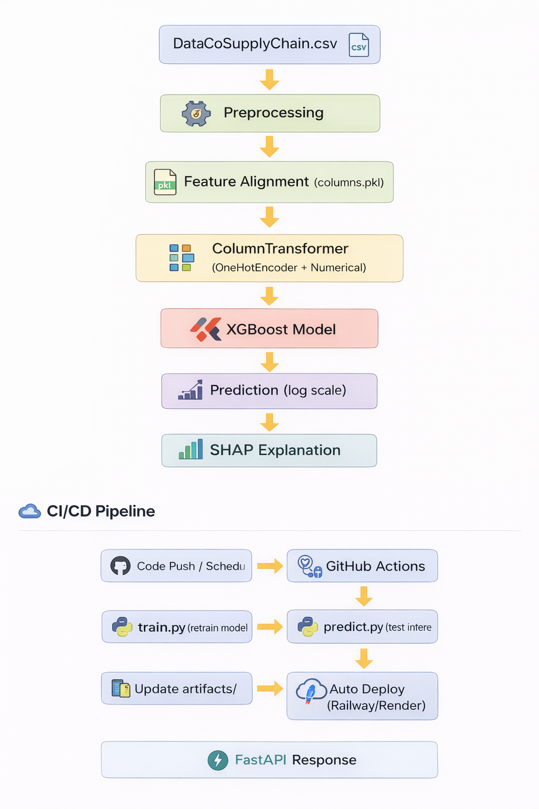

# 📦 Supply Chain Sales Prediction System (MLOps Pipeline)

## 🚀 Overview

This project is an end-to-end Machine Learning system to predict **sales values** from supply chain data.

It includes:
- Data preprocessing & feature engineering
- XGBoost model with hyperparameter tuning
- FastAPI inference API
- SHAP explainability
- CI/CD for automated training & deployment

---

## 🔁 End-to-End Flow

Raw Data → Preprocessing → Feature Alignment → Encoding → Model → Prediction → SHAP → API Response

---

## 📥 1. Raw Input (Initial Data)

The model reads data from:

DataCoSupplyChain.csv

Example (single row):

- Type: DEBIT  
- Days for shipping (real): 3  
- Product Price: 327.75  
- Customer Segment: Consumer  

---

## ⚙️ 2. Preprocessing (preprocess.py)

Raw data is transformed into model-ready format:

- Clean column names  
- Extract date features (month, week, etc.)  
- Feature engineering:
  - delay_flag
  - is_weekend
- Log transformations:
  - sales_log
  - profit_log

---

## 🧩 3. Feature Alignment

```python
df = df.reindex(columns=columns, fill_value=0)
```

---

## 🔢 4. Model Input (Actual Input to Model)

```python
X_transformed = preprocessor.transform(df_single)
```

This converts data into:
- Fully numeric format  
- One-hot encoded features  
- Model-ready vector  

---

## 🤖 5. Model Prediction

Model used: XGBoost Regressor

```python
pred_log = model.predict(df_single)
prediction = expm1(pred_log)
```

---

## 📤 6. Output

Prediction: 327.80

---

## 🔍 7. SHAP Explainability

Example:

- Sales Per Customer → +0.72  
- Department Name Fitness → -0.04  
- Category Name Sporting Goods → -0.009  

Positive → increases prediction  
Negative → decreases prediction  

---

## 🏗️ Architecture Diagram



---


## 🎯 Final System Capabilities

- Automated ML training  
- Real-time API prediction  
- Explainable AI (SHAP)  
- CI/CD pipeline  
- Production-ready structure  

---

## 🧠 Summary

Data → Features → Model → Prediction → Explanation → Deployment → Automation
